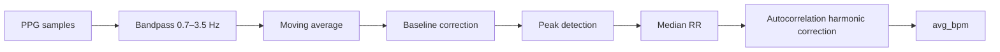
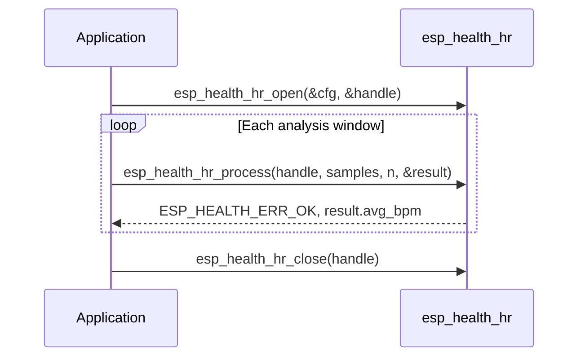

# Heart Rate Detection (HR)

- [中文版](./README_HR_CN.md)

Heart Rate Detection (HR) estimates heart rate in BPM from PPG (photoplethysmography) samples. The module applies bandpass filtering, rolling-mean smoothing, baseline correction, and peak detection, then computes BPM from the **median** RR interval with autocorrelation harmonic correction. Processing is performed on a block of floating-point samples per call.

The module targets **static or low-motion** PPG heart-rate measurement. It does not acquire or drive hardware.

## Processing Pipeline

Each `esp_health_hr_process` call runs the following pipeline on the current analysis window:

BPM is computed from the median RR: `BPM = sample_rate × 60 / median_RR_samples`. Autocorrelation then corrects common 0.5× / 2/3× / 3/2× / 2× harmonic errors. At least two valid peaks are required (three on windows of 4 s or longer); otherwise `ESP_HEALTH_ERR_OK` is returned with BPM 0.

## Terminology

| Term | Meaning |
|------|---------|
| **PPG** | Photoplethysmography, the optical pulse waveform from the sensor |
| **BPM** | Beats per minute, the heart-rate unit reported by this module |
| **RR interval** | Interval between consecutive pulse peaks (in samples) |
| **Median RR** | Median of valid RR intervals in the window; used for `avg_bpm` (not the mean) |
| **Peak** | Pulse peak after bandpass and baseline correction |
| **Bandpass** | About 0.7–3.5 Hz; keeps the heart-rate band and suppresses baseline drift and high-frequency noise |
| **Autocorrelation / harmonic correction** | Checks periodicity and corrects common 0.5× / 2/3× / 3/2× / 2× harmonic errors |
| **avg_bpm / min_bpm / max_bpm** | Median BPM after correction, plus BPM from instantaneous RR extrema; 0 when there is no valid reading |

## Features

- Support PPG sample rates from 16 Hz to 1000 Hz; must match the actual sensor acquisition rate
- Time-domain peak detection with low CPU cost, suitable for MCU-constrained devices
- Valid BPM is 40–200; when there is no reliable reading the API returns `ESP_HEALTH_ERR_OK` with BPM 0
- No motion artifact suppression; to support it, the user needs IMU gating or signal-quality checks in the application

## Intended Use

| Scenario | Notes |
|----------|--------|
| **Resting heart rate** | Sitting or lying still, stable wrist/finger contact, little body motion |
| **Sleep (still segments)** | Periods with little movement after falling asleep |
| **Desk / office** | Typing or reading with small arm motion and low overall activity |
| **Finger-clip PPG** | Finger pressed on the sensor (e.g. MAX30102) |
| **Still-segment baseline** | Resting HR core in a product pipeline |

**Do not use alone** for the following (add ACC activity grading, adaptive filtering, SQI, and similar in the application):

- Walking, running, cycling, stair climbing, and other moderate-to-high activity
- Wrist watches during arm swing, sports, or workouts
- Loose wear, poor contact, or unknown signal quality

## Performance

Measured with IDF v6.x, `CONFIG_COMPILER_OPTIMIZATION_PERF`, working buffers in internal SRAM.

Reference example: [`examples/heart_rate_detect`](../examples/heart_rate_detect) (MAX30102 PPG sensor, 100 Hz sample rate).

Memory and CPU scale with **sample rate** and the **input duration** of `esp_health_hr_process` (`num_samples / sample_rate`). `open` pre-allocates about a 10 s window; longer inputs grow buffers on the first `process` and reuse them afterwards.

`CPU loading (%) = process time / input duration × 100`. 12 s window, sine-PPG micro-benchmark (72 BPM), mean of 8 runs after warmup:

| Chip | CPU | Sample rate (Hz) | Input duration (s) | Memory (Byte) | CPU loading (%) | Run time (ms) |
|------|-----|------------------|--------------------|---------------|-----------------|---------------|
| ESP32-S3 | 240 MHz | 64 | 12 | 27928 | 0.062 | 7.44 |
| ESP32-S3 | 240 MHz | 100 | 12 | 43992 | 0.120 | 14.39 |
| ESP32-S31 | 320 MHz | 64 | 12 | 27928 | 0.044 | 5.26 |
| ESP32-S31 | 320 MHz | 100 | 12 | 43928 | 0.082 | 9.83 |
| ESP32-P4 | 400 MHz | 64 | 12 | 27928 | 0.035 | 4.23 |
| ESP32-P4 | 400 MHz | 100 | 12 | 43928 | 0.066 | 7.92 |

Note:

1. Memory is mostly internal working buffers and scales with duration and sample rate; the table is measured after `open` + first-process growth.
2. CPU / run time are from a sine-PPG micro-benchmark; peak load may be higher under multitasking.

## Usage

Typical call sequence:

1. Fill `esp_health_hr_cfg_t` (`sample_rate` must be 16–1000 Hz)
2. Call `esp_health_hr_open` to create a handle
3. Call `esp_health_hr_process` with a block of `float` PPG samples
4. Read `esp_health_hr_result_t` only on `ESP_HEALTH_ERR_OK`; `avg_bpm == 0` means no valid reading this window
5. Call `esp_health_hr_close` when done

The handle is **not thread-safe**. Do not call `open` / `process` / `close` concurrently on the same handle.

Hardware example: [heart_rate_detect](../examples/heart_rate_detect)

## FAQ

1. **How does heart rate detection work?**  
   See “Processing Pipeline” above. Filter coefficients are generated from the configured sample rate at `esp_health_hr_open`.

2. **How many samples should I pass per call?**  
   Use a window long enough to capture several heartbeats (e.g. 8–15 s at 64–100 Hz). Working buffers grow as needed up to about 60 s; longer recordings use the latest 60 s. Very short windows (including after bandpass trim) return `ESP_HEALTH_ERR_OK` with BPM 0.

3. **What sample rates are supported?**  
   `esp_health_hr_cfg_t.sample_rate` must be 16–1000 Hz. Common values are 64 Hz and 100 Hz (typical for MAX30102).

4. **When is `avg_bpm` 0?**  
   Common causes: sensor not worn correctly, insufficient samples, motion artifacts, or poor contact. `esp_health_hr_process` still returns `ESP_HEALTH_ERR_OK`; treat BPM 0 as no reading this window. Ensure stable finger placement, use a sufficient analysis window, and verify PPG signal quality before calling the algorithm.
