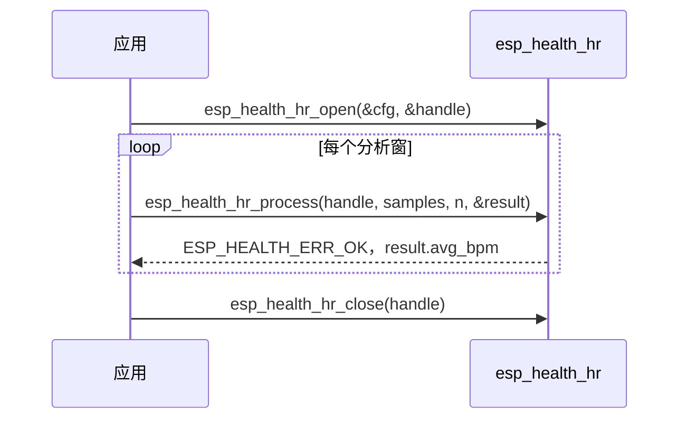

# 心率检测（HR）

- [English Version](./README_HR.md)

心率检测（HR）模块从 PPG（光电容积脉搏波）采样数据中估算心率（BPM）。算法对输入信号进行带通滤波、滑动平均平滑、基线校正和峰值检测，再根据 RR 间期的**中位数**计算心率，并用自相关做倍频/分频校正。每次调用处理一块浮点型 PPG 样本。

本模块面向**静止或低运动**条件下的 PPG 心率测量，组件本身不负责硬件采集与驱动。

## 处理流程

每次 `esp_health_hr_process` 对当前分析窗执行如下流水线：

心率由 RR 中位数计算：`BPM = sample_rate × 60 / median_RR_samples`。随后用自相关校正常见的 0.5× / 2/3× / 3/2× / 2× 倍频误差。至少需要 2 个有效峰值（窗口 ≥ 4 s 时需要 3 个），否则返回 `ESP_HEALTH_ERR_OK` 且 BPM 为 0。

## 术语

| 术语 | 含义 |
|------|------|
| **PPG** | 光电容积脉搏波，传感器输出的光学脉搏波形 |
| **BPM** | 每分钟心跳次数，本模块输出的心率单位 |
| **RR 间期** | 相邻脉搏峰值之间的间隔（以样本数计） |
| **中位数 RR** | 分析窗内有效 RR 的中位数，用于计算 `avg_bpm`（不用均值） |
| **峰值** | 带通与基线校正后检测到的脉搏峰 |
| **带通** | 约 0.7–3.5 Hz，保留心率频段、抑制基线漂移与高频噪声 |
| **自相关 / 倍频校正** | 用自相关检验周期，纠正常见的 0.5× / 2/3× / 3/2× / 2× 倍频误差 |
| **avg_bpm / min_bpm / max_bpm** | 校正后的中位心率，以及瞬时 RR 极值对应的心率；无有效读数时为 0 |

## 主要特性

- 支持 16–1000 Hz PPG 采样率，须与传感器实际采集速率一致
- 基于时域峰值检测，实现简单、CPU 占用低，适合 MCU 资源受限场景
- 有效心率范围 40–200 BPM；无可靠读数时返回 `ESP_HEALTH_ERR_OK` 且 BPM 为 0
- 无运动伪迹抑制；若需支持，用户须在应用层加入 IMU 门控或信号质量判断

## 适用场景

| 场景 | 说明 |
|------|------|
| **静息心率** | 用户静坐、躺卧，手腕/手指贴合稳定，无明显体动 |
| **睡眠监测（静止段）** | 入睡后体动较少的时段 |
| **桌面/办公** | 打字、阅读等上肢微动、整体运动强度低的场景 |
| **指夹式 PPG** | 手指按压传感器，接触稳定（如 MAX30102） |
| **静止段基线测量** | 作为产品中静息心率算法核心 |

**不建议单独使用的场景**（需在上层叠加 ACC 运动分级、自适应滤波、SQI 等）：

- 走路、跑步、骑行、爬楼梯等中高强度活动
- 腕部手表在挥臂、打球、健身等场景
- 佩戴松动、接触不良或信号质量未知时

## 📦 性能

在 IDF v6.x、`CONFIG_COMPILER_OPTIMIZATION_PERF`、工作区位于内部 SRAM 的条件下测得。

参考示例：[`examples/heart_rate_detect`](../examples/heart_rate_detect)（MAX30102 PPG 传感器，100 Hz 采样率）。

内存与 CPU 随 **采样率** 和 **`esp_health_hr_process` 输入时长**（`num_samples / sample_rate`）变化：`open` 按约 10 s 窗预分配，更长输入会在首次 `process` 时扩容并复用。

`CPU loading (%) = process 耗时 / 输入时长 × 100`。12 s 输入窗，正弦 PPG 微基准（72 BPM），warmup 后 8 次平均：

| 芯片 | CPU | 采样率 (Hz) | 输入时长 (s) | 内存 (Byte) | CPU loading(%) | 运行时间 (ms) |
|------|-----|-------------|--------------|-------------|----------------|---------------|
| ESP32-S3 | 240 MHz | 64 | 12 | 27928 | 0.062 | 7.44 |
| ESP32-S3 | 240 MHz | 100 | 12 | 43992 | 0.120 | 14.39 |
| ESP32-S31 | 320 MHz | 64 | 12 | 27928 | 0.044 | 5.26 |
| ESP32-S31 | 320 MHz | 100 | 12 | 43928 | 0.082 | 9.83 |
| ESP32-P4 | 400 MHz | 64 | 12 | 27928 | 0.035 | 4.23 |
| ESP32-P4 | 400 MHz | 100 | 12 | 43928 | 0.066 | 7.92 |

说明：

1. 内存主要为内部工作缓冲，大致随时长与采样率成正比；表中为 `open` + 首次 `process` 扩容后的实测。
2. CPU / 耗时为正弦 PPG 微基准；多任务场景下峰值可能更高。

## 使用方法

典型调用序列：

1. 填写 `esp_health_hr_cfg_t`（`sample_rate` 须为 16–1000 Hz）
2. 调用 `esp_health_hr_open` 创建句柄
3. 每次传入一块 `float` PPG 样本，调用 `esp_health_hr_process`
4. 仅在返回 `ESP_HEALTH_ERR_OK` 时读取 `esp_health_hr_result_t`；`avg_bpm == 0` 表示本窗无有效读数
5. 使用完毕后调用 `esp_health_hr_close`

句柄**非线程安全**。请勿在同一句柄上并发调用 `open` / `process` / `close`。

完整硬件示例：[heart_rate_detect](../examples/heart_rate_detect)

## 常见问题

1. **心率检测是如何工作的？**  
   见上文「处理流程」。滤波系数在 `esp_health_hr_open` 时根据采样率自动生成。

2. **每次应传入多少样本？**  
   分析窗口应足够长以覆盖多个心跳周期（如 64–100 Hz 下 8–15 s）。工作缓冲按需扩容，最长约 60 s；更长录音使用最近 60 s。窗口过短（含带通裁剪后过短）、信号弱或运动干扰较大时返回 `ESP_HEALTH_ERR_OK` 且 BPM 为 0。

3. **支持哪些采样率？**  
   `esp_health_hr_cfg_t.sample_rate` 须在 16–1000 Hz。常用值为 64 Hz、100 Hz（MAX30102 典型配置）。

4. **什么时候 `avg_bpm` 为 0？**  
   常见原因：传感器未正确佩戴、样本数不足、运动伪影或接触不良。`esp_health_hr_process` 仍返回 `ESP_HEALTH_ERR_OK`；BPM 为 0 表示本窗无有效读数。请保持手指稳定贴合传感器发光面，使用足够长的分析窗口，并在调用算法前确认 PPG 信号质量。
