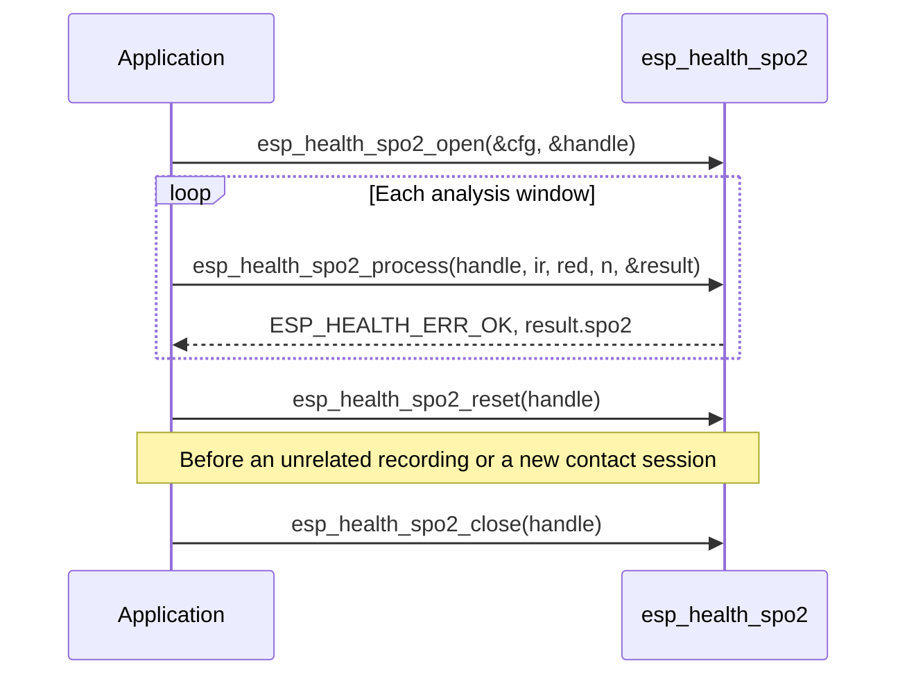

# Blood Oxygen Saturation Detection (SpO2)

- [中文版](./README_SPO2_CN.md)

Blood oxygen saturation (SpO2) is estimated from synchronous infrared (IR) and red PPG channels. The module removes DC offset and linear trend, computes the AC/DC ratio of both channels, and maps the ratio-of-ratios through a configurable calibration polynomial. Correlation and autocorrelation check signal quality and reject noisy or motion-corrupted windows. Each call processes a pair of equal-length floating-point IR / Red arrays.

The module targets **static or low-motion** reflectance/transmittance PPG SpO2. Default calibration matches MAX30102-class 660 nm / 880 nm sensors and is **not medical-grade**.

## Terminology

| Term | Meaning |
|------|---------|
| **PPG** | Photoplethysmography, the optical pulse waveform from the sensor |
| **IR** | Infrared LED channel (typically ~880 nm on MAX30102-class parts) |
| **Red** | Red LED channel (typically ~660 nm) |
| **DC** | Mean / slowly varying level of a PPG window; must be positive |
| **AC** | Pulsatile component after DC and linear-trend removal (RMS in this module) |
| **R** | Ratio-of-ratios `(AC_red / DC_red) / (AC_ir / DC_ir)` |
| **SpO2** | Estimated arterial oxygen saturation in percent |
| **Correlation / autocorrelation** | How alike IR and Red AC are; whether IR AC is periodic at the pulse rate |

## Features

- Support PPG sample rates from 16 Hz to 1000 Hz; must match the actual sensor acquisition rate. IR/Red must have **positive DC**
- Dual-channel ratio-of-ratios estimate; default calibration matches MAX30102-class sensors (660 nm / 880 nm) and can be replaced for other front-ends
- IR/Red correlation and autocorrelation quality gates reject unreliable windows (`min_correlation` / `min_autocorrelation_ratio` in `[0, 1]`; **0 disables** that gate)
- Valid SpO2 is 70–100 %; when there is no reliable reading the API returns `ESP_HEALTH_ERR_OK` with `spo2 = 0`
- No motion artifact suppression; to support it, the user needs wear detection, IMU gating, or SQI in the application layer

## Processing Pipeline

Each `esp_health_spo2_process` call runs the following pipeline on the current analysis window:


Calibration:

```text
R    = (AC_red / DC_red) / (AC_ir / DC_ir)
SpO2 = a * R^2 + b * R + c
```

Default coefficients (`ESP_HEALTH_SPO2_CFG_DEFAULT()`, MAX30102-class): `a = -45.060`, `b = 30.354`, `c = 93.245`. `R` must lie in `[r_min, r_max]` (default `[0.02, 1.84]`) and the mapped SpO2 must lie in 70–100 % or the result is rejected. `a` / `b` match the classic Fraczkiewicz / SparkFun polynomial; `c` is 1.6 lower to reduce a systematic high reading on finger-clip PPG versus a reference pulse oximeter (PhysioNet PTT-PPG sitting). For the textbook `c = 94.845`, override `calib.c` on the default config. The default polynomial is not medical-grade and is not a 70–100 % hypoxia calibration; recalibrate for other wavelengths or optics.

The handle keeps periodicity state across `process()` calls. Call `esp_health_spo2_reset()` before an unrelated recording.

## Intended Use

| Scenario | Notes |
|----------|--------|
| **Finger-clip SpO2** | Finger pressed stably on the optical window (e.g. MAX30102) |
| **Resting SpO2** | Sitting or lying still, stable contact, little body motion |
| **Sleep (still segments)** | Periods with little movement after falling asleep |
| **Still-segment baseline** | Resting SpO2 core in a product pipeline |

**Do not use alone** for the following (add wear detection, activity grading, SQI, and similar in the application):

- Walking, running, cycling, stair climbing, and other moderate-to-high activity
- Wrist watches during arm swing, sports, or workouts
- Loose wear, poor contact, or unsynchronized IR/Red channels

## Performance

Measured with IDF v6.x, `CONFIG_COMPILER_OPTIMIZATION_PERF`, working buffers in internal SRAM.

Reference example: [`examples/spo2_detect`](../examples/spo2_detect) (MAX30102 dual-channel PPG, 100 Hz, about a 5 s analysis window).

Memory and CPU scale with **sample rate** and the **input duration** of `esp_health_spo2_process` (`num_samples / sample_rate`). `open` pre-allocates about a 5 s IR/Red working buffer; longer inputs grow buffers on the first `process` and reuse them afterwards.

The module is software-only (float) and does not require a dedicated peripheral. Relative to HR, each window processes two channels plus correlation / autocorrelation, so CPU grows roughly linearly with duration and sample rate.

`CPU loading (%) = process time / input duration × 100`. 5 s window, dual-channel sine-PPG micro-benchmark, mean of 8 runs after warmup:

| Chip | CPU | Sample rate (Hz) | Input duration (s) | Memory (Byte) | CPU loading (%) | Run time (ms) |
|------|-----|------------------|--------------------|---------------|-----------------|---------------|
| ESP32-S3 | 240 MHz | 64 | 5 | 2628 | 0.0021 | 0.10 |
| ESP32-S3 | 240 MHz | 100 | 5 | 4164 | 0.0031 | 0.16 |
| ESP32-S31 | 320 MHz | 64 | 5 | 2628 | 0.0018 | 0.09 |
| ESP32-S31 | 320 MHz | 100 | 5 | 4164 | 0.0028 | 0.14 |
| ESP32-P4 | 400 MHz | 64 | 5 | 2628 | 0.0014 | 0.07 |
| ESP32-P4 | 400 MHz | 100 | 5 | 4164 | 0.0022 | 0.11 |

Note:

1. Memory is the IR/Red working buffer after `open` + first-process growth.
2. CPU / run time are from a sine-PPG micro-benchmark; peak load may be higher under multitasking.

Accuracy on PhysioNet Pulse Transit Time PPG sitting recordings (MAX30101 finger clip vs iHealth Air, 5 s window / 1 s hop, 8 subjects, healthy 96–99 %): default calibration MAE ≈ 0.80 %, RMSE (Arms) ≈ 0.91 %, all **valid** windows within ±2 %. This is not a 70–100 % hypoxia calibration study.

## Usage

Typical call sequence:



1. Initialize `esp_health_spo2_cfg_t` with `ESP_HEALTH_SPO2_CFG_DEFAULT()`, then override `sample_rate`, `calib`, and quality gates as needed
2. Call `esp_health_spo2_open` to create a handle
3. Call `esp_health_spo2_process` with synchronous IR and Red blocks
4. Read `esp_health_spo2_result_t` only on `ESP_HEALTH_ERR_OK`; `spo2 == 0` means no valid reading this window (`correlation` / `quality_ratio` are still written)
5. Call `esp_health_spo2_reset` before an unrelated recording on the same handle
6. Call `esp_health_spo2_close` when done

The handle is **not thread-safe**. Do not call `open` / `process` / `reset` / `close` concurrently on the same handle.

Hardware example: [spo2_detect](../examples/spo2_detect)

## FAQ

1. **How does SpO2 detection work?**  
   See “Processing Pipeline” above. Noisy, aperiodic, non-positive-DC, or out-of-range windows still return `ESP_HEALTH_ERR_OK` with `spo2 = 0`.

2. **How many samples should I pass per call?**  
   Use a window long enough to cover several heartbeats (the example uses 5 s at 100 Hz). IR and Red arrays must have the same length and `num_samples` must be at least 2. Working buffers grow as needed up to about 60 s. Short windows, poor contact, or motion often fail the quality gates. Periodicity state is kept across `process()` calls; call `esp_health_spo2_reset()` for an unrelated recording.

3. **What sample rates are supported?**  
   `esp_health_spo2_cfg_t.sample_rate` must be 16–1000 Hz. Common values are 64 Hz and 100 Hz (typical for MAX30102). The periodicity search range is derived from 40–220 BPM at open time.

4. **When is `result.spo2` 0?**  
   Common causes: unstable finger placement, non-positive DC, low IR/Red correlation, aperiodic signal (motion / ambient light), or `R` / SpO2 outside the valid range. `esp_health_spo2_process` still returns `ESP_HEALTH_ERR_OK`; treat `spo2 == 0` as no reading this window. Keep the finger covering the optical window, use a sufficient analysis window, and confirm the two channels are synchronous and usable before calling the algorithm.

5. **How do I adapt a non-MAX30102 PPG front-end?**  
   Replace `a` / `b` / `c` and `r_min` / `r_max` in `esp_health_spo2_calib_t`, and calibrate against a reference pulse oximeter on the target sensor. Do not reuse the default coefficients when the wavelength or optical path differs.
