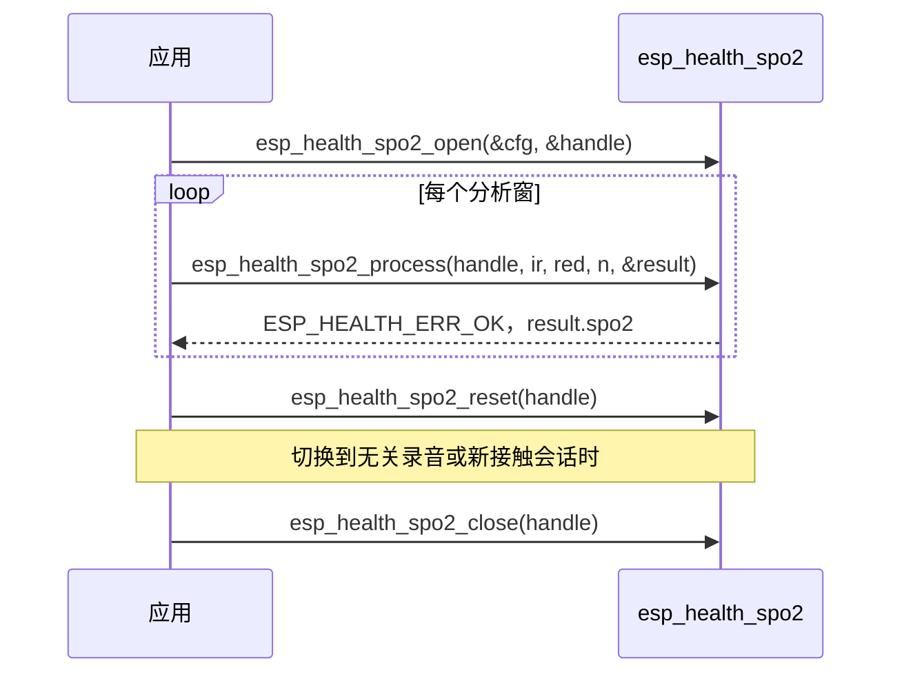

# 血氧饱和度检测（SpO2）

- [English Version](./README_SPO2.md)

血氧饱和度（SpO2）模块从同步采集的红外（IR）与红光（Red）双通道 PPG 中估算血氧百分比。算法去除直流与线性趋势后，计算两通道的 AC/DC 比值，再通过可配置的校准多项式将比值比（ratio-of-ratios）映射为 SpO2；并用相关与自相关检验信号质量，拒绝噪声或运动干扰过强的窗口。每次调用处理一对等长的浮点型 IR / Red 样本。

本模块面向**静止或低运动**条件下的反射/透射 PPG 血氧测量。默认校准针对 MAX30102 类 660 nm / 880 nm 传感器，**非医疗级**。

## 术语

| 术语 | 含义 |
|------|------|
| **PPG** | 光电容积脉搏波，传感器输出的光学脉搏波形 |
| **IR** | 红外 LED 通道（MAX30102 类约 880 nm） |
| **Red** | 红光 LED 通道（MAX30102 类约 660 nm） |
| **DC** | 分析窗内 PPG 的均值 / 缓变电平，须为正 |
| **AC** | 去掉 DC 与线性趋势后的脉搏交流分量（本模块用 RMS） |
| **R** | 比值比 `(AC_red / DC_red) / (AC_ir / DC_ir)` |
| **SpO2** | 估算的动脉血氧饱和度（%） |
| **相关 / 自相关** | 双通道 AC 是否同形；IR AC 是否呈心跳周期 |

## 主要特性

- 支持 16–1000 Hz PPG 采样率，须与传感器实际采集速率一致；IR/Red 须为**正直流**原始 PPG
- 双通道 ratio-of-ratios 估计，校准系数默认同 MAX30102 类传感器（660 nm / 880 nm），可按前端替换
- 通过 IR/Red 相关系数与自相关质量比过滤不可靠窗口（`min_correlation` / `min_autocorrelation_ratio` 取值 `[0, 1]`，**0 表示关闭该门限**）
- 有效 SpO2 范围 70–100 %；无可靠读数时返回 `ESP_HEALTH_ERR_OK` 且 `spo2 = 0`
- 无运动伪迹抑制；若需支持，用户须在应用层加入佩戴检测、IMU 门控或信号质量判断

## 处理流程

每次 `esp_health_spo2_process` 对当前分析窗执行如下流水线：


校准关系：

```text
R    = (AC_red / DC_red) / (AC_ir / DC_ir)
SpO2 = a * R^2 + b * R + c
```

默认系数（`ESP_HEALTH_SPO2_CFG_DEFAULT()`，MAX30102 类）：`a = -45.060`，`b = 30.354`，`c = 93.245`。`R` 须落在 `[r_min, r_max]`（默认 `[0.02, 1.84]`），映射后的 SpO2 须落在 70–100 %，否则判定为不可靠。`a` / `b` 与经典 Fraczkiewicz / SparkFun 多项式相同；`c` 下调 1.6，用于抵消指夹 PPG 相对参考血氧仪的系统性偏高（PhysioNet PTT-PPG 静坐）。若需教科书系数 `c = 94.845`，在默认配置上修改 `calib.c`。默认多项式非医疗级，也不是 70–100 % 低氧标定；换波长或光路时必须重新标定。

句柄会跨 `process()` 调用保留周期性状态；切换到无关录音前请调用 `esp_health_spo2_reset()`。

## 适用场景

| 场景 | 说明 |
|------|------|
| **指夹式血氧** | 手指稳定按压传感器发光面（如 MAX30102） |
| **静息血氧** | 用户静坐、躺卧，接触稳定，无明显体动 |
| **睡眠监测（静止段）** | 入睡后体动较少的时段 |
| **静止段基线测量** | 作为产品中静息血氧算法核心 |

**不建议单独使用的场景**（需在上层叠加佩戴检测、运动分级、SQI 等）：

- 走路、跑步、骑行、爬楼梯等中高强度活动
- 腕部手表在挥臂、打球、健身等场景
- 佩戴松动、接触不良或 IR/Red 通道不同步时

## 📦 性能

在 IDF v6.x、`CONFIG_COMPILER_OPTIMIZATION_PERF`、工作区位于内部 SRAM 的条件下测得。

参考示例：[`examples/spo2_detect`](../examples/spo2_detect)（MAX30102 双通道 PPG，100 Hz 采样率，约 5 s 分析窗）。

内存与 CPU 随 **采样率** 和 **`esp_health_spo2_process` 输入时长**（`num_samples / sample_rate`）变化：`open` 按约 5 s 窗预分配 IR/Red 工作缓冲，更长输入会在首次 `process` 时扩容并复用。

算法为纯软件浮点处理，无专用外设依赖；相对心率模块，每窗需同时处理两个通道并做相关/自相关，CPU 随时长与采样率近似线性增长。

`CPU loading (%) = process 耗时 / 输入时长 × 100`。5 s 输入窗，正弦双通道 PPG 微基准，warmup 后 8 次平均：

| 芯片 | CPU | 采样率 (Hz) | 输入时长 (s) | 内存 (Byte) | CPU loading(%) | 运行时间 (ms) |
|------|-----|-------------|--------------|-------------|----------------|---------------|
| ESP32-S3 | 240 MHz | 64 | 5 | 2628 | 0.0021 | 0.10 |
| ESP32-S3 | 240 MHz | 100 | 5 | 4164 | 0.0031 | 0.16 |
| ESP32-S31 | 320 MHz | 64 | 5 | 2628 | 0.0018 | 0.09 |
| ESP32-S31 | 320 MHz | 100 | 5 | 4164 | 0.0028 | 0.14 |
| ESP32-P4 | 400 MHz | 64 | 5 | 2628 | 0.0014 | 0.07 |
| ESP32-P4 | 400 MHz | 100 | 5 | 4164 | 0.0022 | 0.11 |

说明：

1. 内存为 IR/Red 工作缓冲，`open` + 首次 `process` 扩容后的实测。
2. CPU / 耗时为正弦 PPG 微基准；多任务场景下峰值可能更高。

精度（PhysioNet Pulse Transit Time PPG 静坐，MAX30101 指夹 vs iHealth Air，5 s 窗 / 1 s 步进，8 名受试者，健康 96–99 %）：默认校准 MAE ≈ 0.80 %，RMSE（Arms）≈ 0.91 %，**有效窗口**误差均在 ±2 % 内。这不是 70–100 % 低氧标定实验。

## 使用方法

典型调用序列：



1. 使用 `ESP_HEALTH_SPO2_CFG_DEFAULT()` 初始化 `esp_health_spo2_cfg_t`，按需覆盖 `sample_rate`、`calib` 以及相关/自相关门限
2. 调用 `esp_health_spo2_open` 创建句柄
3. 每次传入同步的 IR、Red 样本块，调用 `esp_health_spo2_process`
4. 仅在返回 `ESP_HEALTH_ERR_OK` 时读取 `esp_health_spo2_result_t`；`spo2 == 0` 表示本窗无有效读数（`correlation` / `quality_ratio` 仍会写入）
5. 同一句柄切换到无关录音前调用 `esp_health_spo2_reset`
6. 使用完毕后调用 `esp_health_spo2_close`

句柄**非线程安全**。请勿在同一句柄上并发调用 `open` / `process` / `reset` / `close`。

完整硬件示例：[spo2_detect](../examples/spo2_detect)

## 常见问题

1. **血氧检测是如何工作的？**  
   见上文「处理流程」。窗口过噪、非周期、直流非正或结果越界时仍返回 `ESP_HEALTH_ERR_OK`，此时 `spo2 = 0`。

2. **每次应传入多少样本？**  
   分析窗口应覆盖多个心跳周期（示例为 100 Hz 下 5 s）。IR 与 Red 数组长度必须相同，且 `num_samples` 至少为 2。工作缓冲按需扩容，最长约 60 s。窗口过短、接触不良或运动干扰较大时，质量门限可能失败。`process()` 会跨调用保留周期性状态；无关录音请先调用 `esp_health_spo2_reset()`。

3. **支持哪些采样率？**  
   `esp_health_spo2_cfg_t.sample_rate` 须在 16–1000 Hz。常用值为 64 Hz、100 Hz（MAX30102 典型配置）。周期搜索范围在 `open` 时按 40–220 BPM 由采样率推算。

4. **什么时候 `result.spo2` 为 0？**  
   常见原因：手指未稳定贴合、直流非正、IR/Red 相关过低、信号非周期（运动/环境光）、`R` 或 SpO2 超出有效区间。`esp_health_spo2_process` 仍返回 `ESP_HEALTH_ERR_OK`；`spo2 == 0` 表示本窗无有效读数。请保持手指覆盖传感器发光面，使用足够长的分析窗口，并在调用算法前确认双通道同步且信号质量可用。

5. **如何适配非 MAX30102 的 PPG 前端？**  
   替换 `esp_health_spo2_calib_t` 中的 `a` / `b` / `c` 以及 `r_min` / `r_max`，用金标准血氧仪在目标传感器上标定。波长或光路不同时，不得直接套用默认系数。
